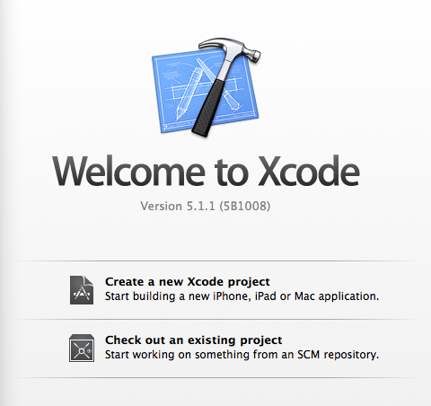
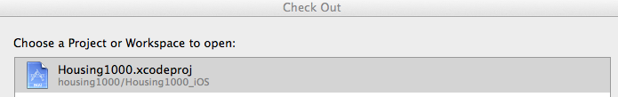

CTAGroup Android/iOS Survey Apps
================================

The goal of these mobile apps is to allow a user to conduct surveys from Android/iOS devices on site.  This includes capturing the interviewee's signature, taking any relevant photos, and submitting answers to the survey questions.  The surveys and questions are pulled from a remote server and the UI for them is dynamically generated in the mobile apps.

A Point In Time (PIT) survey is also available, which allows the user to fill out general info on a group of people, such as the number of males/females, age groups, location etc.

#Setup Guide#

##Android##

- Download and install **[Android Studio](http://tools.android.com/download/studio/canary)** ([IntelliJ IDEA](http://www.jetbrains.com/idea/) can also be used, but Android Studio will most likely be easier to set up since it includes the Android SDK/ADT files)
- Make sure that you have the latest Android SDK updates in your SDK Manager
- Start Android Studio.  You should be presented with a "Welcome to Android Studio" screen.  If not, you most likely have a project open. If so, go to File -> Close
- From the welcome screen, choose "Check out from version control," then **GitHub**
- Put in your github credentials and clone this repository

- Choose "Import project from external model," then **Gradle**
- Point the top text box to the **build.gradle** file located in the "housing1000/android/Housing1000" folder, use the **default gradle wrapper** and click **Finish**

> The project should now be imported.  However, you will most likely be met with a few errors:

> - Android studio might complain about your VCS root path. Click configure to fix it. Make sure that the "Project" value is set to **None**.  Android studio will recommend another path in that dialog for you to use.
> - There will be several objects in your project that are highlighted red.  This is because the project hasn't been built yet and you are also missing some libraries. Click the "**Sync Project with Gradle Files**" button on the top toolbar that will download any missing dependencies and build things for you.

##iOS##

- Download and install the latest version of **[Xcode](https://developer.apple.com/xcode/downloads/)**.
- Start up Xcode and choose to "Check out an existing project."

- Enter the repo location (https://github.com/WeberState/cs3750fall2013group3/) and hit next.
- Choose the directory where you want it to be checked out to.
- When prompted to "Choose a Project or Workspace to open," select the Housing1000.xcodeproj file.

- You'll see that it tries to build and fails with some nasty looking errors. This is because it doesn't have the dependencies it needs. Just close this Xcode window.

> The next step is to install CocoaPods, which is what we've used for managing dependencies:

> - Open up the command line and run this command to update your current Ruby version: **sudo gem update --system**
> - Next, run: **sudo gem install cocoapods**
> - Next, run: **pod setup --verbose**

- Cool, CocoaPods is installed. Now with your terminal still open, navigate to the root directory of the project (which should be cs3750fall2013group3/housing1000/Housing1000_iOS).
- Run ***pod install***. This will fetch the required dependencies to run the project and will also create a new file called Housing1000.xcworkspace in the root directory of your project.
- As stated in the command line window, from now on use this new Housing1000.xcworkspace file. Navigate to it in Finder and just double click.
- The project will automatically build and you'll be good to go.

#API Guide#

Here is brief breakdown of the REST API endpoints that these apps hit. These APIs are ever changing, so this is only high level.

- **@GET("/SurveySite/api/survey")** For the normal survey portion of the app, this returns a list of available surveys that the user can select. It includes the Survey's title and its ID. 

- **@GET("/SurveySite/api/survey/{id}")** The Survey ID that the user selects above is then requested by the apps in this call. It returns a list of questions in a JSON format with the same fields listed for each question. The different fields for each question specify question type, whether it is dependent on another question's answer, the data type, etc. The JSON has two sections: client and survey questions. We honestly don't know the difference between the two sections (especially since they have the same format and the apps display them in the same way as the other questions), except that the client questions never seem to change from survey to survey and the ParentRequiredAnswer doubly serves as the name of our name-value pair responses for these question answers (recently, it seems, they got rid of the client questions, although there will still be an empty JSON array named “Client” in the API response).

- **@POST("/SurveySite/api/survey/{id}")** This is where we post the answers to the survey in a JSON format. Some of the answer formats need to be very specific. For example, the answers for a MultiSelect question need to have each checked question in a pipe-delimited list.

- **@POST("/SurveySite/api/upload")** This is where we upload the signature image, initials image, and any photos.

- **@POST("/SurveySite/Help/Api/POST-api-ROI")** This is where we post metadata about the ROI form, such as the entered name of the person signing.

- **@GET("/SurveySite/api/pit")** This is where we pull down the PIT questions. They are expected to be in the same format as the normal survey questions except that the Client questions are always null.

- **@POST("/SurveySite/api/pit")** This is where we post the PIT answers. Unlike posting a normal survey’s answers, this endpoint accepts an array of answer collections. This is so each household member can be accounted for. The JSON format that this endpoint accepts is also different than what the other normal-survey endpoint accepts.

- **@POST("/SurveySite/token")** This is where we post the username and password. It returns an authentication token that we include in the headers of all other API calls. 

- **@GET("/SurveySite/api/Account/UserInfo")** This is called immediately after login to retrieve information about the user. It is used in displaying a welcome message, in the ROI, and in identifying the currently logged in user when submitting a survey.

- **@GET("/SurveySite/api/EncampmentSite")** We pass a search string to this endpoint and it returns a collection of encampment site details.

- **@GET("/SurveySite/api/EncampmentSite")** This is different than the previous endpoint because we don't pass a search string. It returns questions for creating a new encampment site. The apps expect it to be in the same format as the other surveys.

- **@GET("/SurveySite/api/Survey/GetEncampmentSurvey")** This is used to get the Encampment Site Visit questions. It is also expected to be in the same format as the other surveys.

